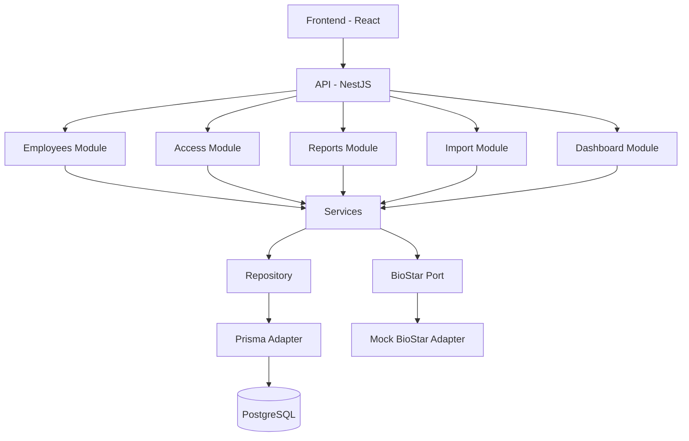

# ARQUITECTURA

## Arquitectura seleccionada

Para este proyecto se propone una arquitectura monolítica modular con separación por capas y principios hexagonales en el núcleo.

La decisión parte de tres criterios principales:

1. El sistema tiene un dominio acotado y una primera entrega enfocada en un MVP funcional.
2. El despliegue previsto puede resolverse en un único artefacto, sin necesidad de distribuir módulos independientes.
3. Las integraciones con BioStar, PostgreSQL, importación de Excel y exportación de reportes se benefician de una estructura clara, pero no requieren la complejidad completa de una arquitectura distribuida o de una Clean Architecture estricta.

En esta propuesta, el dominio y la lógica de negocio quedan protegidos del detalle técnico mediante puertos y adaptadores ligeros. La aplicación sigue siendo un monolito, pero con módulos bien delimitados para evitar que la solución se convierta en un bloque difícil de mantener.

### Ventajas

- Menor complejidad operativa y de despliegue.
- Mayor velocidad de implementación para una prueba técnica con alcance acotado.
- Mejor mantenibilidad que un monolito desordenado, gracias a la separación entre dominio, aplicación e infraestructura.
- Facilidad para integrar BioStar, base de datos, Excel y servicios externos sin acoplar la lógica de negocio al detalle técnico.

### Desventajas

- No ofrece escalado independiente por módulo como lo harían los microservicios.
- Requiere disciplina para no mezclar lógica de negocio con infraestructura.
- Si no se delimita bien cada módulo, puede terminar pareciéndose a un monolito tradicional.

## Arquitecturas descartadas

### Microservicios

Se descartó porque, aunque aporta escalabilidad y despliegue independiente, para el contexto actual del proyecto, los beneficios de una arquitectura de microservicios no compensan el incremento en la complejidad de desarrollo, despliegue y operación. No se requiere ciclo de vida separado por servicio, ni despliegue independiente de módulos, ni una operación distribuida adicional.

#### Pros

- Escalabilidad independiente por servicio.
- Aislamiento entre dominios.
- Despliegues desacoplados.

#### Contras

- Mayor complejidad operativa y de infraestructura.
- Más costo en observabilidad, pruebas e integración entre servicios.
- Exceso de complejidad para un MVP con alcance acotado.

### Clean Architecture

Se descartó como versión completa porque, aunque ofrece un desacoplamiento muy bueno, introduce una abstracción elevada que no parece necesaria para este proyecto. Para esta entrega, una versión simplificada con principios hexagonales resulta suficiente.

#### Pros

- Muy buen desacoplamiento entre reglas de negocio e infraestructura.
- Alta testabilidad.
- Facilidad para reemplazar componentes técnicos.

#### Contras

- Mayor cantidad de capas, interfaces y tipos intermedios.
- Puede volver la solución más difícil de leer y mantener para el tamaño actual del proyecto.
- Riesgo de sobrediseño si se aplica con demasiado rigor desde el inicio.

### Hexagonal completa

También se descarta una versión muy estricta de arquitectura hexagonal, aunque se conservan algunos de sus principios mediante el uso de puertos e implementaciones concretas (adaptadores) para la persistencia de datos, la integración con BioStar y la importación de archivos.

#### Pros

- Aísla correctamente el núcleo del sistema.
- Facilita pruebas unitarias y de integración.
- Encaja bien con integraciones externas como BioStar o PostgreSQL.

#### Contras

- Exige más diseño inicial y más abstracciones.
- Si se lleva al extremo, puede ralentizar la implementación del MVP.

## Técnologias seleccionadas

### Frontend
Siguiendo las indicaciones del cliente se utilizará React.

### Base de datos
Siguiendo las indicaciones del cliente se utilizará PostgreSQL.

### Contenerización
Siguiento las indicaciones del cliente se utilizará Docker.

### Backend
Como tecnología base para el backend se seleccionó Node.js junto con NestJS. Durante la evaluación también se consideró FastAPI con Python, ya que cumplía con los requisitos técnicos del proyecto; sin embargo, se optó por mantener un ecosistema unificado basado en TypeScript, facilitando la consistencia entre el frontend y el backend, así como el mantenimiento del proyecto.

Respecto al framework, se evaluaron Express y NestJS. Aunque Express ofrece una gran flexibilidad para estructurar una aplicación, se decidió utilizar NestJS por su mejor alineación con la arquitectura propuesta. Su enfoque modular, la separación clara de responsabilidades, la inyección de dependencias y la organización mediante módulos, controladores y servicios permiten implementar de forma natural un monolito modular con principios hexagonales, favoreciendo la mantenibilidad, la escalabilidad y la evolución del sistema sin introducir una complejidad innecesaria. 

### ORM
Se seleccionó Prisma ORM como herramienta de acceso a datos por su integración nativa con TypeScript y PostgreSQL.

## Diagrama de Componentes

