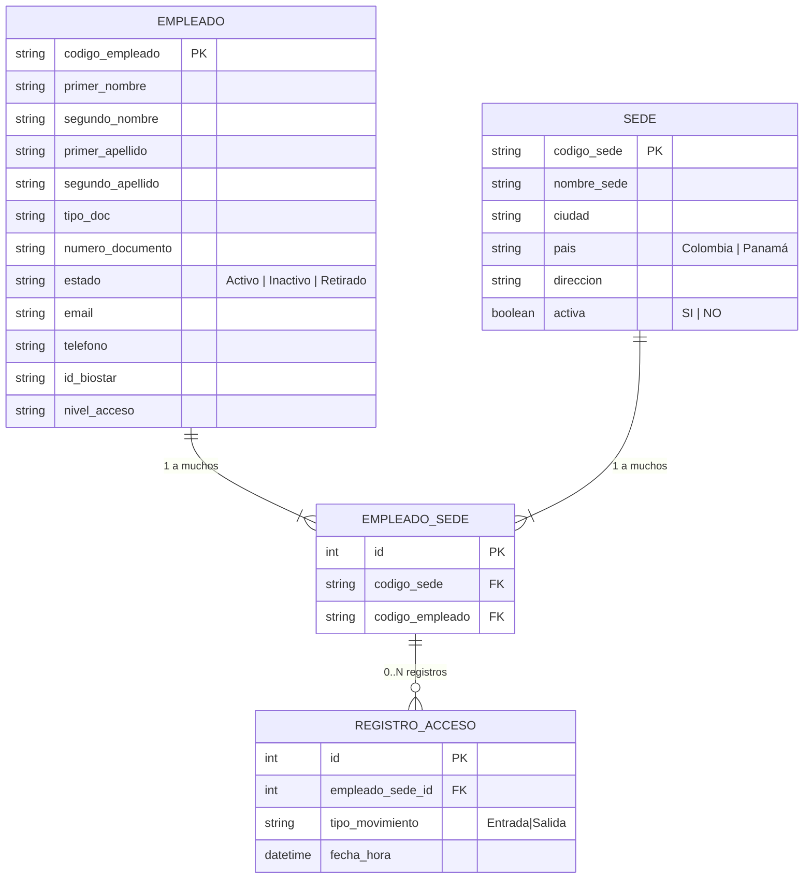

# Diagrama Entidad - Relación

```mermaid
erDiagram

    SEDE {
        string codigo_sede PK
        string nombre_sede
        string ciudad
        string pais "Colombia | Panamá"
        string direccion
        boolean activa  "SI | NO"
    }

    EMPLEADO {
        string codigo_empleado PK
        string primer_nombre
        string segundo_nombre
        string primer_apellido
        string segundo_apellido
        string tipo_doc
        string numero_documento
        string estado "Activo | Inactivo | Retirado"
        string email
        string telefono
        string id_biostar
        string nivel_acceso
    }

    EMPLEADO_SEDE {
        int id PK
        string codigo_sede FK
        string codigo_empleado FK
    }

    REGISTRO_ACCESO {
        int id PK
        int empleado_sede_id FK
        string tipo_movimiento "Entrada|Salida"
        datetime fecha_hora
    }

    EMPLEADO ||--|{ EMPLEADO_SEDE : "1 a muchos"
    SEDE ||--|{ EMPLEADO_SEDE : "1 a muchos"
    EMPLEADO_SEDE ||--o{ REGISTRO_ACCESO : "0..N registros"
```

## Cambios respecto al archivo de Excel
