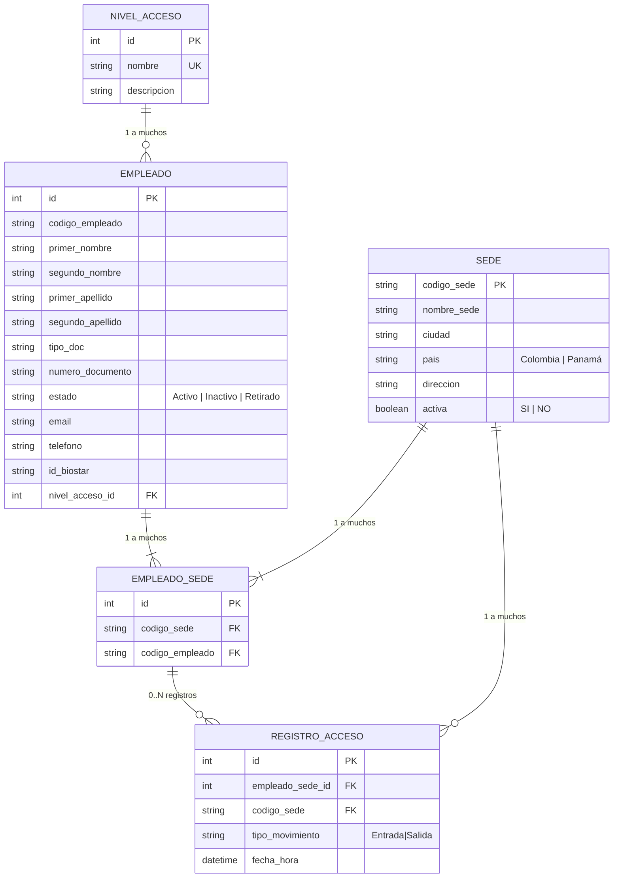

# Diagrama Entidad - Relación

## Cambios respecto al archivo de Excel

### Descartes
Se descartaron los siguientes campos referentes a los empleados:
- Area, Cargo, Centro_costo, Tipo_contrato, Fecha_ingreso, Fecha_retiro, Tarjeta_rfid, Jornada. Estos fueron debido a que no sumaban valor ni eran necesarios en la entidad.
- Sede, Pais. Estos fueron debido a que se pueden obtener, la Sede desde la entidad Empleado_Sede y el país desde la entidad Sede.

### Cambios en los campos
Se han definido campos obligatorios y opcionales, esto con el fin de rechazar el registro solo de aquellos empleados a quienes le falte información crucial:
- Obligatorio: Codigo_empleado, Primer_nombre, Primer_apellido, Tipo_documento, Numero_documento, Estado, Id_biostar, Nivel_acceso.
- Opcionales: Segundo_nombre, Segundo_apellido, Email, Telefono.

El campo `nivel_acceso` no se manejará como texto libre. Se normalizará mediante un catálogo de niveles de acceso.

En Empleado_Sede (codigo_sede+codigo_empleado) funciona como unique para evitar duplicados del mismo empleado en la misma sede.

### Adiciones
Se añadieron 2 entidades: 
- RegistroAcceso: se encarga de registrar cada ingreso o salida de un empleado, su sede y la hora y fecha en que sucede.
- EmpleadoSede: junta a un empleado con una sede, esto permite que un empleado pueda tener más de una sede asignada y luego usarlo como validación al momento del ingreso.