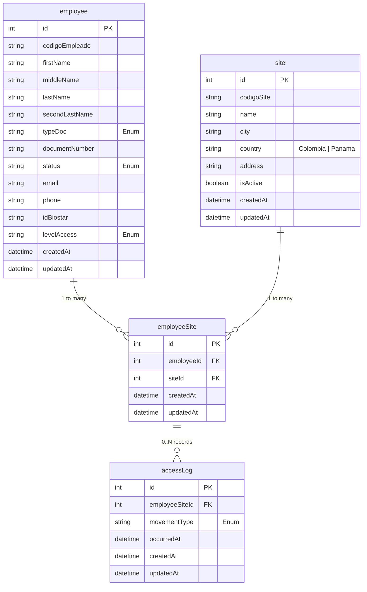

# Diagrama Entidad - Relación

## Decisiones de modelado

- El modelo usará nombres en inglés y `camelCase` para tablas y campos.
- `employee.id`, `site.id`, `employeeSite.id` y `accessLog.id` serán claves primarias autoincrementales.
- `employee.codigoEmpleado` será único.
- La combinación `employee.typeDoc` + `employee.documentNumber` será única para evitar duplicados de personas.
- La combinación `employeeId` + `siteId` será única en `employeeSite`.
- `site.codigoSite` será único.
- `typeDoc`, `status`, `movementType` y `levelAccess` se manejarán como enums.
- `createdAt` y `updatedAt` estarán presentes en todas las tablas.
- No se usará `deletedAt`.
- Las reglas de negocio no se forzarán en la base de datos; se validarán en la aplicación.
- No se aplicará `cascade` para no perder historial de accesos si se elimina un empleado.
- `site` no tendrá relación directa con `accessLog`; la sede del acceso se resolverá a través de `employeeSite`.

## Cambios respecto al archivo de Excel

### Descartes
Se descartaron los siguientes campos referentes a los empleados:
- Area, Cargo, Centro_costo, Tipo_contrato, Fecha_ingreso, Fecha_retiro, Tarjeta_rfid, Jornada. Estos fueron debido a que no sumaban valor ni eran necesarios en la entidad.
- Sede, Pais. Estos fueron debido a que se pueden obtener, la sede desde la entidad employeeSite y el país desde la entidad site.

### Cambios en los campos
Se han definido campos obligatorios y opcionales, esto con el fin de rechazar el registro solo de aquellos empleados a quienes le falte información crucial:
- Obligatorio: codigoEmpleado, firstName, lastName, typeDoc, documentNumber, status, idBiostar, levelAccess.
- Opcionales: middleName, secondLastName, email, phone.

La entidad `site` se modelará con `name`, `city`, `country`, `address` e `isActive`, además de su `codigoSite` como identificador único funcional.

El campo `levelAccess` no se manejará como texto libre. Se normalizará como enum.

En `employeeSite` la combinación `employeeId + siteId` funcionará como unique para evitar duplicados del mismo empleado en la misma sede.

### Adiciones
Se añadieron 2 entidades:
- accessLog: se encarga de registrar cada ingreso o salida de un empleado, su sede y la hora y fecha en que sucede.
- employeeSite: junta a un empleado con una sede, esto permite que un empleado pueda tener más de una sede asignada y luego usarlo como validación al momento del ingreso.

### Trazabilidad futura de importación
Por ahora no se almacenará el archivo crudo ni un historial completo de la importación. El proceso se centrará en validar la información, depurarla y persistir solo los datos correctos.

Si más adelante se requiere trazabilidad detallada, se podría incorporar una entidad de cabecera de importación y una de detalle de errores para registrar:
- nombre del archivo;
- fecha de carga;
- usuario que ejecutó la importación;
- estado del proceso;
- filas aceptadas y rechazadas;
- motivo de cada rechazo.

Esto permitiría auditar cargas históricas sin contaminar el modelo principal del negocio desde el inicio.